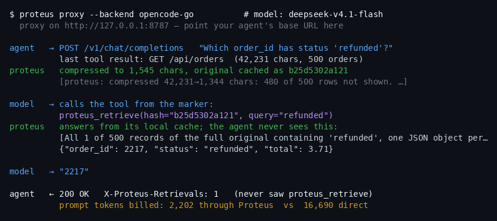
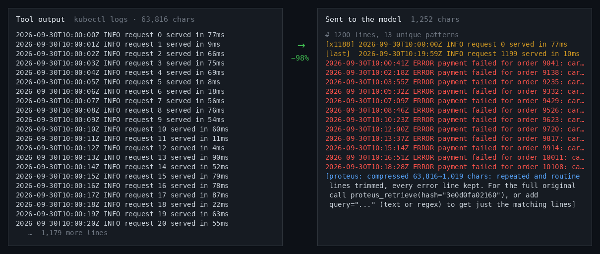
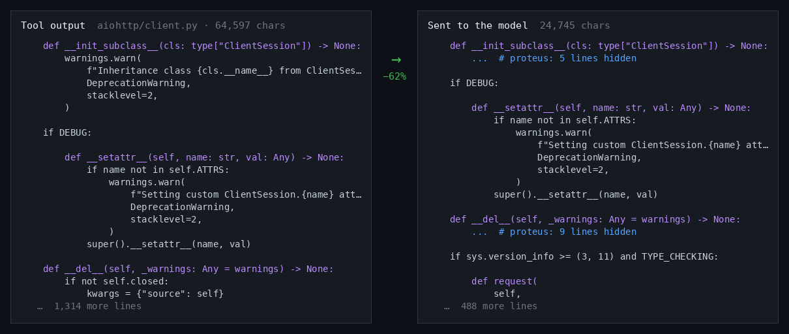
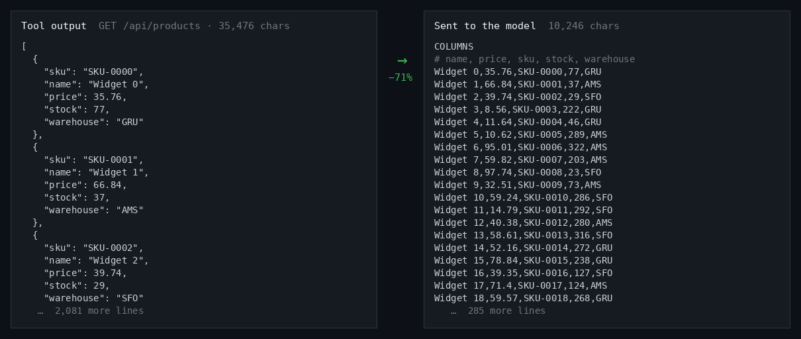

# Proteus

**A local proxy that shrinks large tool outputs before your LLM agent sends them to the model.**

[](https://github.com/Dylan-Demolder/proteus/actions/workflows/ci.yml)
[](https://www.python.org/downloads/)
[](LICENSE)



*A real request to deepseek-v4.1-flash through the proxy, recorded by [`benchmarks/make_readme_media.py --model deepseek-v4.1-flash`](benchmarks/make_readme_media.py). The model's tool call, its answer and the token counts are the API's own.*

Coding agents spend most of their tokens re-sending what their tools returned: file reads, logs, API responses, grep hits. Proteus sits between the agent and any OpenAI-compatible API. It rewrites each large tool result into a compact form that keeps what matters. It stores the original locally. It lets the model fetch any part of the original when the compact form isn't enough. Your agent needs no code changes.

In multi-turn agent runs on DeepSeek v4.1 flash, Proteus got the same 48/48 answers right as going direct, at 71% lower cost ([results](#results)).

## Quick start

```bash
pip install git+https://github.com/Dylan-Demolder/proteus.git   # not on PyPI yet

export OPENCODE_GO_API_KEY=...          # or OPENROUTER_API_KEY / OPENAI_API_KEY
proteus proxy --backend opencode-go     # or: openrouter | openai | generic --upstream-url URL --api-key-env VAR
```

Then set your agent's API base URL to `http://localhost:8787/v1` and use it as usual.

To see it working:

```bash
curl -s localhost:8787/readyz            # requests seen, compressed, chars and tokens saved, retrieves served
proteus proxy --log-file proteus.jsonl   # one JSON line per request: compressed count, chars saved, timings
```

Every proxied reply also carries an `X-Proteus-Retrievals` header with the number of retrieves the proxy answered for that request.

## What your model sees

Each pair is a real tool output and exactly what the proxy sends in its place. The images are generated by [`benchmarks/make_readme_media.py`](benchmarks/make_readme_media.py), so they always reflect the current compressors.

**Logs:** 1,200 lines become a count of the routine lines, plus every error line.



**Python:** a large file becomes a skeleton. Signatures stay and function bodies are hidden, and the model can fetch any function whole.



**JSON:** an array of uniform objects becomes columns, with every row kept.



When something the model needs isn't shown, the marker at the end tells it how to ask. Here, 480 of 500 orders were left out, and the model needed the refunded one:

```
model  →  proteus_retrieve(hash="b25d5302a121", query="refunded")
proxy  →  [All 1 of 500 records of the full original containing 'refunded', one JSON object per line]
          {"order_id": 2217, "status": "refunded", "total": 3.71}
```

The proxy answers that call itself from its local cache and asks the model again. Your agent never sees `proteus_retrieve`. It just gets the final answer, streamed or not.

## How it works

```
your agent
   │  POST /v1/chat/completions
   ▼
Proteus proxy  (localhost:8787)
   │  for each tool result over 3,000 chars:
   │    detect its type      JSON · logs · code · grep · diff · ls · text
   │    compress it          if that saves under 25%, send the original instead
   │    cache the original   ~/.proteus/cache/<hash>
   │    append a marker      what was left out, and how to get it back
   ▼
your LLM provider
   │
   ├── model calls proteus_retrieve(hash, query)?
   │      the proxy answers from the cache and asks again (up to 3 rounds)
   ▼
your agent gets the final answer, streamed or not, and never sees proteus_retrieve
```

Tool output means `role: "tool"` messages, `tool_result` parts and large user messages. The proxy offers the `proteus_retrieve` tool on every request that has tools, so the prompt prefix stays stable and provider caching keeps working. No model is involved in compression: it's deterministic and rule-based, and takes a few milliseconds.

| Content | What the model gets | What it doesn't see until it asks |
|---|---|---|
| JSON array of uniform objects | Every row, as CSV-like columns | Nothing (lossless) |
| JSON array, 200+ mixed rows | First and last 10 rows, plus numeric ranges | The middle rows |
| JSON object | Compact JSON; string values over 1,000 chars replaced by a reference | Those long strings |
| Logs, build output | Repeated lines as counts, every error and stack-trace line, outlier values flagged | The individual routine lines |
| grep / rg results | About 30 matches, unusual ones first; the rest summarised by shape | The repetitive matches |
| Python | Comments and docstrings removed; files over 20K chars as a skeleton | Comments, and hidden function bodies |
| JS / TS / Go / Rust | Comments removed | Comments |
| Diffs | Every changed line, 2 lines of context; extra hunks and files listed by name | Distant context, hunks and files past the caps |
| `ls -l` listings | Names, sizes and dates | Permissions and owners |
| Text over 10K chars | The first and last ~2,000 chars | The middle |

## Results

These are measured on [OpenCode Go](https://opencode.ai/docs/go/) with the eval scripts in [`benchmarks/`](benchmarks/), comparing each run direct to the API with the same run through Proteus. Full method, per-task numbers and what each run changed are in [docs/live-eval-results.md](docs/live-eval-results.md).

**Agent loops:** multi-turn, streaming, prompt caching on. 8 tasks × 6 runs per mode ([`agent_eval.py`](benchmarks/agent_eval.py)):

| model | correct, direct → Proteus | prompt tokens | estimated cost |
|---|---|---|---|
| deepseek-v4.1-flash | 48/48 → 48/48 | 4.48M → 1.21M | $0.366 → $0.107 (−71%) |
| mimo-v2.6-flash | 48/48 → 47/48 | 1.53M → 0.54M | $0.121 → $0.040 (−67%) |

**Single tool result, one question:** 7 scenarios × 10 runs per mode ([`live_eval.py`](benchmarks/live_eval.py)):

| model | correct, direct → Proteus | prompt tokens |
|---|---|---|
| deepseek-v4.1-flash | 58/70 → 69/70 | 805K → 270K (−66%) |
| mimo-v2.6-flash | 63/70 → 65/70 | 965K → 247K (−74%) |

What to expect:

- **Savings come from big outputs.** Tasks that read large files or API responses cost 63–79% less. Tasks that mostly run `search`, whose results are already small, come out roughly even.
- **Cost falls less than tokens.** Providers bill a cached, re-sent prompt at a few percent of the normal price, so most of the saving comes from the turn where a large output first enters the conversation.
- **Retrieval isn't free.** After a retrieve, the context holds both versions. Markers say exactly what was left out, so models retrieve only when they need to (`code_function`: about 1 run in 20).
- **The synthetic ratios** (`python test/benchmark_all.py`, 48 scenarios) average 63% fewer chars. Real source code compresses less: about 20% for comment stripping alone, and 60% as a skeleton.

## Configuration

Every setting is in [`config.yaml`](config.yaml) at its default. Three profiles bundle them:

```bash
proteus proxy --profile aggressive          # conservative | balanced (default) | aggressive
proteus proxy --config my.yaml              # your settings, plus proxy host/port/backend
```

Command-line flags override the file, and the file overrides the profile. Unknown keys and wrong types are errors that name the key. The proxy reloads the file when it changes, and keeps its current settings if an edit is invalid. `conservative` never drops JSON rows or summarises text.

## Other ways to use it

**As a library**, for agents you control:

```python
from proteus import compress_tool_output
from proteus.ccr import retrieve

compressed, stats = compress_tool_output(big_tool_output)   # unchanged if small or incompressible
print(stats["content_type"], stats["compression_pct"], stats["hash"])
original = retrieve(stats["hash"])                           # byte-for-byte original

from proteus.history import compress_history
messages, stats = compress_history(messages)   # compress tool results from older turns, safe to call every turn
```

**From the command line:**

```bash
proteus file big.json        # show what a file compresses to
proteus retrieve <hash>      # print a cached original
proteus stats                # cache size and location
proteus clear                # empty the cache
```


## Limitations

- **OpenAI-compatible chat completions only.** The Anthropic `/v1/messages` API isn't supported.
- **Retrieval needs the proxy.** In library and CLI mode, nothing answers `proteus_retrieve`, so dropped rows and text are only recoverable through `ccr.retrieve()` in your own code.
- **The cache stores raw tool output on disk.** Treat `~/.proteus/cache/` as sensitive; see [SECURITY.md](SECURITY.md).
- **Not on PyPI yet.** It will be published as `proteus-compress`; the import and CLI stay `proteus`.
- **Alpha.** Expect rough edges. See [CHANGELOG.md](CHANGELOG.md).

## Development

```bash
pip install -e ".[dev]"
for f in test/run_all.py test/test_*.py; do python "$f" || exit 1; done   # what CI runs
ruff check src/ test/ benchmarks/ && mypy
python benchmarks/live_eval.py --dry-run     # which answers survive compression, no API calls
```

See [CONTRIBUTING.md](CONTRIBUTING.md) for layout and how to add a compressor. [`demos/`](demos/) has two runnable end-to-end demos, and [`integrations/`](integrations/) has scripts for wiring Proteus into an agent.

## Background

Proteus started as a fork of HeadRoom, rebuilt for OpenAI-compatible backends: pure Python, no ML on the hot path, and no Anthropic-specific features. It is named after the Greek sea god who changed shape while staying himself.

Apache 2.0.
