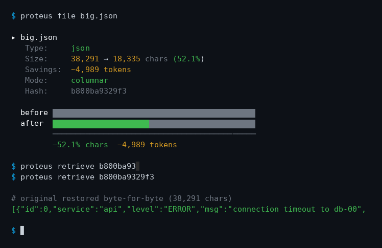

# Proteus

**Shape-shifting compression for LLM tool outputs.**

[](https://github.com/Dylan-Demolder/proteus/actions/workflows/ci.yml)
[](https://www.python.org/downloads/)
[](LICENSE)
[](https://github.com/astral-sh/ruff)
[](https://mypy-lang.org/)
[](#tests)

Proteus sits between your LLM agent and the API provider, compressing large tool outputs before they reach the model. Same answers, fraction of the tokens.



*Real run — `proteus file` on a 38KB JSON array, then `proteus retrieve` to restore the original byte-for-byte. Regenerate with `python benchmarks/make_demo_gif.py`.*

```
Tool output (terminal, file read, search results)
    │
    │  >3K chars?  ─── No ──→ Pass through
    │  Yes
    ▼
    ContentRouter ─→ [JSON | Logs | Code | Search | Diff | Text]
         │                    │
         │          Compress + store original in CCR cache
         ▼
    Compressed output + hash marker → LLM
```

## Quick start

Install straight from GitHub:

```bash
pip install git+https://github.com/Dylan-Demolder/proteus.git
```

> **Note:** The distribution is named `proteus-compress` — `proteus` was already
> taken on PyPI by an unrelated project. The import name and CLI entry point are
> unchanged: `import proteus` / `proteus proxy`.
>
> The package is **not on PyPI yet**; once it is, the install becomes
> `pip install proteus-compress`. Verify a given install with
> `pip show proteus-compress`.

### Proxy mode (transparent, no code changes)

```bash
# OpenCode Go (flat-rate — recommended)
proteus proxy --backend opencode-go   # forwards your client's x-opencode-session, or derives one per conversation

# OpenRouter (pay-per-token)
proteus proxy --backend openrouter

# Custom endpoint
proteus proxy --backend generic --upstream-url https://my-api.com/v1 --api-key-env MY_KEY
```

Then configure your agent to use `http://localhost:8787/v1` as the API base URL. Large tool results (`role: "tool"` messages) are compressed automatically, for streaming and non-streaming requests alike.

### Library mode (inline in your code)

```python
from proteus import compress_tool_output
from proteus.ccr import retrieve

# Compress large tool output before sending to LLM
result = open("/path/to/big.json").read()
compressed, stats = compress_tool_output(result)
print(f"Saved {stats['compression_pct']:.1f}% — {stats['estimated_token_savings']} tokens")

# Retrieve original when needed:
original = retrieve(stats["hash"])
```

### CLI mode

```bash
proteus file path/to/big.json    # Compress and show stats
proteus cache path/to/cache.json  # Pre-compress a cache file on disk
proteus stats                     # Show CCR cache statistics
proteus retrieve <hash>           # Retrieve original from cache
proteus clear                     # Clear the cache
```

### Configuration

Thresholds live in [`config.yaml`](config.yaml), which lists every setting at its default, and three profiles bundle them:

```bash
proteus proxy --profile aggressive                  # conservative | balanced (default) | aggressive
proteus proxy --config my.yaml                      # settings + proxy host/port/backend
proteus proxy --config my.yaml --profile conservative
proteus file big.json --profile aggressive
```

Precedence, lowest to highest: built-in defaults, then the profile (`--profile`, else the file's `profile:` key), then the keys in the file, then command-line flags for the `proxy:` section. Unknown keys and wrongly typed values are errors that name the key. The proxy re-reads the file when it changes. An invalid edit is logged and the previous settings stay live.

From Python:

```python
from proteus import config
from proteus.profiles import use_profile

use_profile("aggressive")            # or: config.configure("my.yaml", profile="aggressive")
config.update({"JSON_DROP_HEAD": 5})
config.reset()                       # back to defaults
```

## Showcase

### 🌤 Weather Dashboard (demos/weather-dashboard)

A real HTML/CSS/JS weather app that fetches live data from wttr.in — served as an end-to-end compression demo.

**Real-world test on 9 files (300KB → 111KB, 63%) — 6 static + 3 generated by the demo script:**

| File | Type | Size | Saved |
|---|---|---|---|
| `combined-project.txt` | text | 130.9KB → **4.6KB** | **96.5%** |†|
| `weather-api-response.json` | json | 38.7KB → 23.1KB | 40.3% | |
| `weather-api-reykjavik.json` | json | 38.8KB → 23.2KB | 40.1% | |
| `weather-api-tokyo.json` | json | 38.7KB → 23.1KB | 40.2% | |
| `LIVE-wttr.in-Tokyo.json` | json | ~38.6KB → 23.1KB | ~40.3% |†|
| `app.js` | code_javascript | 5.1KB → 4.7KB | 8.4% | |
| `index.html` | text | 2.8KB → 2.8KB | — | |
| `styles.css` | text | 4.2KB → 4.2KB | — | |
| `build-output.log` | logs | 2.2KB → 2.2KB | — |†|
| **Total (9 files)** | | **300KB → 111KB** | **63.0%** | |

*† File generated at runtime by `run_proteus_test.py` — not tracked in the repo.*

**Verification:**
- ✅ All 9 files: byte-for-byte match after CCR roundtrip
- ✅ All 7 weather fields identical on 4 API responses (temp, humidity, pressure, UV, wind direction/speed)
- ✅ Live API fetch from wttr.in compressed and decompressed successfully
- ✅ Cost savings: $0.15 → $0.06 per run • **~$3,500/year at 100 runs/day** (based on $2/M input tokens)

The combined-project.txt shows the killer use case: an LLM seeing `cat` output of a whole project goes from 131KB (33K tokens) → 4.6KB (1.1K tokens) — identical information, 96% less context cost.

> **Note:** The LIVE API response varies slightly between runs since it fetches real-time weather data. Numbers shown are representative.

### 📊 Log Analyzer (demos/log-analyzer)

A multi-service log analysis pipeline demonstrating Proteus on server output.

**5 files, 257KB → 102KB (60%):**

| File | Size | Saved | Compressor |
|---|---|---|---|
| combined.log (3 services, 800 entries) | 84.6KB → 24.1KB | 71.5% | log_deduper |
| nginx.log (500 lines) | 55.2KB → 22.0KB | 60.1% | log_deduper |
| metadata.json (800 records) | 87.5KB → 28.2KB | 67.8% | json_crusher |
| db.log (100 lines) | 9.7KB → 8.3KB | 14.3% | log_deduper |
| app.log (200 lines) | 19.7KB → 19.6KB | 0.6% | log_deduper |

**Verification:** All 70 analysis metrics (IP counts, status codes, error rates, timing, durations) identical across 5 files after roundtrip — 14 metrics × 5 files, zero failures.

## Benchmarks

### 48-scenario benchmark suite (test/benchmark_all.py)

```
Overall savings     63.0%   (48 scenarios, 502,676 → 185,990 chars)
Latency             ~3ms per call
```

> Earlier versions reported **68.1%** here. That figure was inflated: the router
> treated any `word: text` line as grep output, so logs, CSV, YAML and CLI
> output went to the search compressor, which keeps ~30 lines and drops the
> rest. For example, a 59-line CSV "compressed" 93.5% by keeping 398 of 6,115
> chars. 63.0% is what's left once that content is actually preserved.

### Per-compressor breakdown (48 tests, 7 benchmark categories)

| Compressor | Tests | Avg Savings | Best | Worst |
|---|---|---|---|---|
| log_deduper (logs) | 4 | 90.4% | 99.8% | 0.0% |
| log_deduper (build output) | 4 | 84.8% | 99.7% | 0.0% |
| search | 5 | 84.9% | 97.8% | 43.8% |
| json_crusher | 8 | 67.4% | 99.2% | 51.6% |
| text | 11 | 28.6%* | 81.2% | 0.0% |
| diff | 6 | 27.9% | 54.2% | 0.0% |
| code | 6 | 20.9% | 48.9% | 10.3% |
| below threshold (<3K chars) | 4 | 0.0% | — | — |

*\* Text summarization (head + tail) triggers above 10K chars. Smaller prose, CSV, YAML and CLI output pass through unchanged.*

**Average across all compressors: 63.0% savings at ~3ms latency, 100% reversible.**

Run fresh: `python test/benchmark_all.py`

### Live evaluation against a real model

Compression ratios don't show whether the model still gets the answer right. [`benchmarks/live_eval.py`](benchmarks/live_eval.py) sends 7 agent-style conversations to a real model twice, once direct and once through the proxy. Each conversation is a tool call plus a large tool result with the answer buried in it. The script compares correctness, billed prompt tokens, and how often the model called `proteus_retrieve`. In three of the scenarios the answer is in content the compressor drops, so the model only gets them right by retrieving.

```bash
export OPENCODE_GO_API_KEY=...
python benchmarks/live_eval.py --list-models
python benchmarks/live_eval.py --model <model-id> -v
python benchmarks/live_eval.py --model <model-id> --repeat 20 --concurrency 10   # models vary run to run
python benchmarks/live_eval.py --dry-run          # offline: which answers survive compression
```

Latest results, 20 trials of each scenario per mode ([full findings](docs/live-eval-results.md)):

| model | direct correct | Proteus correct | prompt tokens, direct → Proteus |
|---|---|---|---|
| deepseek-v4.1-flash | 122/140 | 131/140 | 1.62M → 0.64M (−61%) |
| mimo-v2.6-flash | 132/140 | 122/140 | 1.93M → 0.68M (−65%) |

Neither model gave a wrong answer in either mode. Every miss was the model re-running its own tool to double-check instead of answering, which the harness can't execute.

Retrieval isn't free. After a retrieve, the context holds both the compressed and the original output, so a model that retrieves every time costs more than going direct. Net savings depend on the model retrieving only when it needs to.

## Cost Analysis

All data below uses **DeepSeek V4 Flash**. Comparisons show four routing options:

### Quick reference

All figures use **42.9K tokens per request** (the average for a typical tool-output-heavy workflow). The 42.9K baseline is locked by the 25K req/mo example below — the other columns follow from it.

| Route | Pricing | Monthly at 5K req | $10 gets you | Proxy latency vs direct |
|-------|:-------:|:-----------------:|:------------:|:-----------------------:|
| Direct to DeepSeek API | $0.14/M tokens | **$30** | ~1,700 req | N/A |
| Via OpenRouter | $0.14/M tokens | **$30** | ~1,700 req | N/A |
| Via OpenCode Go | $10/month flat | **$10** | **~10,000 req** | N/A |
| **Via OpenCode Go + Proteus** | **$10 + compression** | **$10** | **~13,700 req** | **Up to 2.2× faster** |

> OpenCode Go crosses over at **~1,700 req/month** — above that, the flat $10 beats per-token pricing. At 25K req/mo: **$150 vs $10**.

### Token consumption over 30 days

```
     ┌──────────────────────────────────────────┐
  60M┤■■■■■■■■■■■■■■■■■■■■■■■■■■■■■■■■■■■■■■■  Without compression
     │
  40M┤■■■■■■■■■■■■■■■■■■■■■■■■■■■■■■■■  With Proteus (16.2M fewer)
     │
  20M┤
     │
    0 ╧
     Direct / OpenRouter / OpenCode Go   + Proteus
```

**All three routes consume tokens at the same rate** — the difference is what you pay. Proteus compression cuts the actual tokens sent to the API by **27%** over 30 days (blended rate across all traffic — only content >3KB triggers compression; on those compressible outputs the per-scenario average is **63.0%**). The same work therefore uses less of your OpenCode Go credit budget (or costs less on per-token billing).

### Proxy latency benchmark

| Scenario | Input | Direct | Via Proteus | Δ |
|----------|:-----:|:-----:|:-----------:|:--:|
| Simple chat | ~200 chars | 1,483ms | 1,548ms | +65ms (+4%) |
| 300-token context | ~2,400 chars | 4,270ms | **3,629ms** | **-15%** |
| 10K search results | 72K chars | 929ms | **479ms** | **-48%** |
| 20K stock JSON | 31K chars | 760ms | **471ms** | **-38%** |
| 50K search results | 361K chars | 1,205ms | **545ms** | **-55%** |

> The ~2ms compression overhead is dwarfed by the reduced upstream round-trip — less data to process = faster response. On real tool outputs the proxy is **1.6–2.2× faster** than going direct.

### Real-world savings

In a single benchmark the proxy saved **450,839 chars** (~112,708 tokens) across 3 large requests. At 200 req/day that's **$12+/month saved on token costs** — plus the **$20–140/month savings** from OpenCode Go's flat rate vs per-token billing. The proxy compresses every tool output >3KB automatically, so savings accumulate continuously with no user effort.

## Compressors

| Type | Compressor | Savings | Quality |
|---|---|---|---|
| JSON arrays | json_crusher | 60-99% | 0% (columnar / large-string CCR) |
| JSON arrays (200+ rows) | json_crusher | 90%+ | <5% (row-drop) |
| Single large JSON object | json_crusher | ~99% | 0% (CCR field hashing) |
| Repetitive logs | log_deduper | 85-99% | 0% |
| Timestamp-varying logs | log_deduper | ~88% | 0% (timestamp normalization) |
| Multi-line log blocks | log_deduper | varies | 0% |
| Source code | code | 20-50% | 0% |
| File listings | file_listing | 40-50% | 0% |
| Search results (grep) | search | 50-98% | 0% |
| Git diffs | diff | 20-55% | 0% |
| Long text (>10K) | text | 60-94% | <5% |
| ripgrep context output | search | 80%+ | 0% |

## How it works

Proteus uses **deterministic, rule-based algorithms** — no ML, no models, zero added latency:

1. **ContentRouter** detects the type of content (JSON, code, logs, search results, diffs, listings)
2. Routes to a **specialized compressor** that understands the structure
3. Compresses with structure-aware techniques (columnar format, line dedup, timestamp normalization, CCR field hashing)
4. Stores the **original in a local CCR cache** indexed by hash
5. In proxy mode, offers the LLM a `proteus_retrieve` tool and answers its calls itself, so the model can fetch original data when the compressed view isn't enough

All compression is **reversible** — originals are never lost.

## Key features

- **LLM → CCR bridge**: In proxy mode, each compressed tool result ends with a marker saying what was removed, such as `[proteus: compressed 23,138→6,609 chars: comments and docstrings removed, code unchanged. For the full original call proteus_retrieve(hash="ff5d88df2c6d"), or add query="..." (text or regex) to get just the matching lines]`. When the model calls `proteus_retrieve`, the proxy answers from the local cache and asks the model again. A `query` returns every matching line (as text, a regex, all words, or any word) with two lines of context. The count of retrieves served is in the `X-Proteus-Retrievals` response header. Compression that would save less than `min_savings_pct` (default 25%) is skipped, since a retrieve round would cost more than it saved. Your agent never sees the tool, so it needs no changes. This needs a complete response to inspect, so it applies to non-streaming requests. Streaming requests are still compressed, and their marker records the cache hash (`proteus retrieve <hash>`).
- **Multi-turn history compression** (`history.py`): When a conversation exceeds a threshold, tool results from older turns (OpenAI `role: "tool"` messages, `tool_result`/`text` parts, large user messages) are replaced by their compressed form plus a `proteus_retrieve` marker, and the originals are stored in CCR. It returns a new list, leaves your messages untouched, and is safe to call every turn.
- **Compression profiles** (`profiles.py`): Conservative (least lossy: no row-dropping or text summarization), Balanced (default), Aggressive (max savings). Activate with `--profile` or `use_profile()`; see [Configuration](#configuration).
- **Proxy server** (`proteus proxy`): Transparent aiohttp proxy that auto-compresses tool responses between your agent and the LLM API.
- **Integrations** (`integrations/`): Hook scripts for wiring Proteus into an existing agent — including a Hermes hook that wraps tool output for compression before it reaches the model.

## Why not HeadRoom?

HeadRoom (the upstream project) is excellent but built for Anthropic's API. Proteus is a fork that:

- **Supports multiple backends** — OpenRouter, OpenCode Go, OpenAI, or custom endpoints via `--backend`
- **Pure Python, no Rust** — installs in seconds, no compilation
- **Deterministic only** — no ML compressors on the hot path
- **Multi-turn compression** — compresses accumulated history, not just live output
- **3 compression profiles** — conservative (least lossy), balanced (default), aggressive (max savings)
- **Proxy server** — works with any OpenAI-compatible agent without code changes
- **~90% less code** — same core value, dramatically simpler

## Requirements

- Python 3.10+
- aiohttp (for proxy mode)
- Works with any OpenAI-compatible API (OpenRouter, OpenAI, Groq, Together, etc.)

## Tests

```bash
git clone https://github.com/Dylan-Demolder/proteus.git
cd proteus
pip install -e ".[dev]"

# Run all 10 test suites (571 tests) — same thing CI runs:
for f in test/run_all.py test/test_*.py; do python "$f" || exit 1; done

# Lint + type check (both are CI gates):
ruff check src/ test/ benchmarks/
mypy

# Coverage (CI fails below 80%):
coverage erase
for f in test/run_all.py test/test_*.py; do coverage run --append "$f" >/dev/null; done
coverage report

# Run benchmarks:
python test/benchmark_all.py
```

Test breakdown: 106 engine tests, 57 new compressor tests, 47 coverage gap-fills, 35 edge case tests, 40 integration tests, 31 CLI tests, 34 history tests, 91 profiles tests, 90 proxy & fidelity tests, 40 config tests — **571 total**.

Coverage: **89%** across 10 test suites. CI fails the build below **80%**.

## Project structure

```
proteus/
├── src/proteus/               # Package source
│   ├── compressors/           # Specialized compressors
│   │   ├── json_crusher.py    # JSON columnar + large-string CCR
│   │   ├── log_deduper.py     # Log dedup with timestamp normalization
│   │   ├── code.py            # Code stripping (Python, JS, TS, Go, Rust)
│   │   ├── search.py          # Search/grep results + context lines
│   │   ├── diff.py            # Git diff compression
│   │   └── text.py            # Text summarization
│   ├── proxy/                 # Transparent proxy server
│   ├── ccr.py                 # Compress-Cache-Retrieve store
│   ├── router.py              # Content type detection + routing
│   ├── history.py             # Multi-turn conversation compression
│   ├── profiles.py            # Per-session compression profiles
│   └── cli/                   # CLI commands
├── test/                      # 571 tests
├── benchmarks/                # CI benchmarks
├── demos/
│   ├── weather-dashboard/     # 🌤 HTML/CSS/JS weather app demo
│   └── log-analyzer/          # 📊 Multi-service log analysis demo
└── config.yaml                # Example config
```

## Running the demos

```bash
# Weather Dashboard — compress + verify + cost report
cd demos/weather-dashboard
python run_proteus_test.py

# Log Analyzer — generate, compress, verify, analyze
cd demos/log-analyzer
python run_demo.py
```

## License

Apache 2.0.

## Status

Alpha. Works with any LLM client that speaks the OpenAI-compatible API — OpenRouter, OpenCode Go, OpenAI, Groq, or a custom endpoint via `--backend generic`. Originally built for [Hermes Agent](integrations/README.md), with a hook script shipped in `integrations/`.

Proxy mode is functional but still has rough edges — expect improvements. See [CHANGELOG.md](CHANGELOG.md) for what's landed and [SECURITY.md](SECURITY.md) for the threat model (the CCR cache stores uncompressed tool output on disk — treat it as sensitive).

---

*Named after Proteus, the shape-shifting sea god of Greek myth who could change form while keeping his true nature — exactly what this does to your tool outputs.*